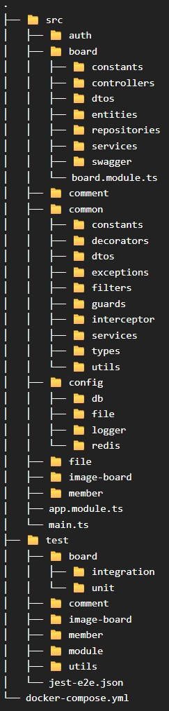
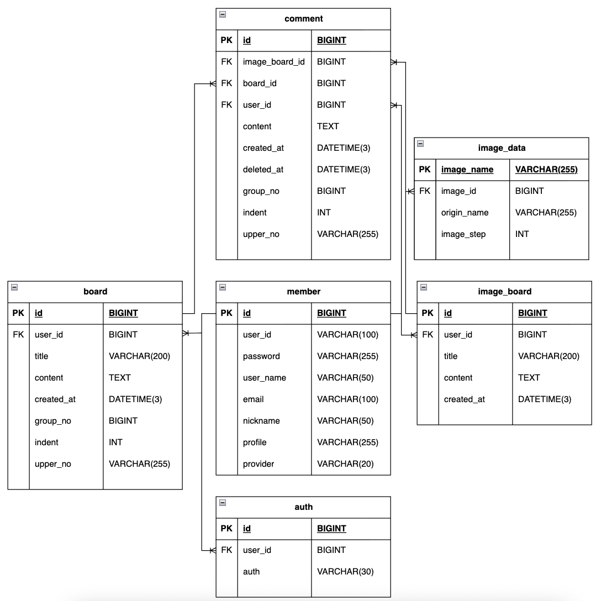

# BoardProject REST API Nest version

<br/>
<br/>

## 프로젝트 개요

### 프로젝트 목적
- **프레임워크 간 아키텍처적 공통성 및 제어 역량 검증**: Java/Spring 환경에서 경험한 IoC 및 DI 개념이 NestJS Decorator Pattern과 모듈 시스템에서 어떻게 구현되고 상호작용하는지 비교 분석하며, 기술 스택에 종속되지 않는 아키텍처 통제 능력 확보
- **런타임 환경별 패러다임 이해를 통한 설계 시야 확장**: Multi Thread 기반의 Spring Blocking 모델과 Single Thread Event Loop 기반의 NestJS 비동기 Non-blocking I/O 처리 방식을 직접 구현하며, 분산 처리에 최적화된 기술 스택을 선택할 수 있는 기반 마련.

<br/>

### 프로젝트 요약
이 프로젝트는 소규모 커뮤니티 서비스를 직접 기획, 설계하여 새로운 기술 스택을 도입할 때 기준점으로 활용하는 테스트베드입니다.

CRUD, 파일 시스템 관리, 계층형 쿼리 등 백엔드의 핵심 기능을 구현하며 각 환경의 특성을 분석하고 있습니다.   
현재는 React 기반의 공통 프론트엔드를 고정하고, 백엔드를 다양한 언어와 프레임워크로 재구현하며 아키텍처의 유연성을 검증하고 있습니다.


#### 프로젝트 버전
1. Spring MVC & JSP, Oracle (<a href="https://github.com/Youndae/BoardProject">Git Repo Link</a>)
   - 초기 설계 및 파일 관리 비즈니스 로직 확립한 최초 버전입니다.
   - 당시 가장 익숙했던 Spring MVC, JSP 환경을 사용하고 새롭게 Oracle을 사용해보며 MySQL과의 문법 및 동작 차이를 학습했습니다.
   - 설계 당시 주요 과제였던 효율적인 파일 관리 문제를 성공적으로 해결해 구현했습니다.
2. Servlet & JSP, JDBCTemplate, MySQL (<a href="https://github.com/Youndae/BoardProject_servlet_jsp">Git Repo Link</a>)
   - 프레임워크의 추상화 계층을 제외한 Legacy 환경에서 요청 처리 흐름을 Low-level부터 파악했습니다.
   - JPA나 MyBatis 없이 JDBCTemplate을 직접 제어하며 영속성 계층의 동작 원리와 프레임워크가 제공하는 편의성의 실체를 체감했습니다.
3. REST API & React
   1. 공통 프론트엔드 (<a href="https://github.com/Youndae/boardProject_client_react">Git Repo Link</a>)
      - React(JSX)를 이용한 최초의 SPA 환경 구축 프로젝트입니다.
      - Axios 기반 통신 구조를 설계하고 컴포넌트 단위로 책임을 분리하여 유지보수성을 높였습니다.
      - 분리된 구조를 활용해 다양한 백엔드 스택의 REST API를 테스트하는 범용 프론트엔드로 활용중입니다.
   2. Spring Boot, JPA, MySQL 버전 (<a href="https://github.com/Youndae/rest-api-project">Git Repo Link</a>)
      - API 서버(board-rest)와 Client 서버(board-app)를 각각 독립적으로 구축했습니다.
      - board-rest(API Server)
       - 서비스의 핵심 비즈니스 로직 및 인증 / 인가를 전담하는 API 서버입니다.
       - JPA를 사용했으며, 데이터를 제공합니다.
         - board-app(View-Centric Server)
       - 자체 DB 없이 WebClient를 사용하여 board-rest와 통신하는 독립 실행 서버입니다.
       - 사용자로부터 받은 인증 정보와 요청을 API 서버로 전달하는 역할을 수행하며, Thymeleaf를 통해 사용자에게 view를 제공합니다.
       - 백엔드와 프론트엔드를 분리해 WebClient로 통신하는 환경 구축을 목적으로 설계하였으며, 서버간 통신 시 발생하는 데이터 직렬화 및 예외 처리 과정을 학습했습니다.
       - React 프론트엔드 구축 이후 리팩토링을 중단한 상태입니다.
   3. Kotlin, Spring Boot 버전 (<a href="https://github.com/Youndae/boardproject_kt">Git Repo Link</a>)
      - Java와 Kotlin의 차이점을 분석하고, data class를 활용한 불변 객체 통제 기법을 학습했습니다.
      - Clean Architecture를 적용하여 도메인 중심 설계를 지향하며, 엄격한 계층 분리가 가져오는 생산성 저하와 같은 실질적인 단점을 분석하고 해결책을 고민했습니다.
   4. Express 버전 (<a href="https://github.com/Youndae/boardproject_ex">Git Repo Link</a>)
      - Spring 환경을 벗어나 Middleware 기반 아키텍처의 빠른 응답 처리와 서비스 레이어의 부담 완화 라는 장점을 확인했습니다.
      - 프레임워크 차원의 트랜잭션 관리 부재로 인해 통합 테스트 시 발생하는 데이터 정합성 관리의 복잡성을 체감했으며, 이를 보완하기 위한 테스트 환경 설계 역량을 키웠습니다.
   5. Nest 버전
      - Module 구조를 통한 체계적인 의존성 관리 방식을 학습했습니다.
      - 의존성 증가에 따라 모듈이 무거워질 수 있다는 단점을 파악하고, 효율적인 모듈 바운더리 설정이 NestJS 설계의 핵심임을 이해했습니다.
      - TypeScript의 엄격한 타입을 통해 Runtime 이전 단계에서의 안정성 확보를 경험했습니다.

## 목차
<strong>1. [개발 환경](#개발-환경)</strong>   
<strong>2. [프로젝트 구조 및 설계 원칙](#프로젝트-구조-및-설계-원칙)</strong>   
<strong>3. [ERD](#ERD)</strong>   
<strong>4. [기능 목록](#기능-목록)</strong>   
<strong>5. [핵심 기능 및 문제 해결](#핵심-기능-및-문제-해결)</strong>   
<strong>6. [프로젝트 회고](#프로젝트-회고)</strong>

<br/>
<br/>

## 개발 환경
| Category      | TechStack                                                                                    |
|---------------|----------------------------------------------------------------------------------------------|
| Backend       | - Node.js <br/> - NestJS 11.0 <br/> - TypeORM <br/> - Path Alias(tsconfig-paths)             |
| Security/Auth | - Passport(Local, Google, Kakao, Naver) <br/> - @nestjs/jwt <br/> - Bcrypt <br/> - Helmet    |
| Database      | - MySQL(mysql2) <br/> - Redis <br/> - typeorm-transactional                                  |
| Validation    | - class-validator <br/> - class-transformer                                                  |
|File| - Multer <br/> - Sharp-fs-extra                                                              |
|Infrastructure/DevOps| - Winston(Logging & Daily Rotate) <br/> - PM2 <br/> - @nestjs/config-Swagger(@nestjs/swagger) |
|Testing| - Jest(Unit & Integration Test) <br/> - Supertest(E2E API Test)                              |

<br/>
<br/>

## 프로젝트 구조 및 설계 원칙

### 구조 설계



프로젝트 구조는 관심사의 명확한 분리와 모듈 간 독립성 확보, 그리고 높은 유지보수성을 최우선으로 고려하여 설계했습니다.   

- **모듈 기반 도메인 주도 분리**: 각 도메인을 응집도 높은 독립적인 Module 단위로 격리하고 board.module.ts와 같이 모듈 내부에서 controllers, services, repositories, entities 계층을 통제하도록 설계했습니다.
- **인프라 및 공통 레이어 격리**: 애플리케이션 전반에 걸쳐 공통으로 사용되는 auth, guard, interceptor, exception filter 등은 common/ 으로 분리하고, 환경 설정 및 외부 Connection 로직은 config/ 내부의 구조로 캡슐화하여 비즈니스 로직과의 결합도를 낮췄습니다.
- **테스트 전략**
  - **도메인 중심 테스트 구조**: src/ 하위의 구성과 1:1로 대응되도록 test/ 하위에서 도메인별로 분리하여 특정 기능 변경 시 관련 테스트를 즉각적으로 식별할 수 있도록 설계했습니다.
  - **테스트 격리 및 다각화**: 각 도메인 내부는 integration과 unit 구조로 명확히 분리하고 전체 시스템 검증을 위한 E2E 테스트 환경을 구축하여 검증의 실효성을 높였습니다.

Java/Spring의 IoC/DI 및 모듈화 개념을 완전히 흡수할 수 있다는 특성을 살려 이식하였으며, 그로 인해 결합도가 낮고 확장 및 테스트가 용이한 백엔드 시스템을 설계 할 수 있었습니다.


### API 응답 표준화

Node.js의 자유로운 객체 설계 구조에서도 일관된 클라이언트 인터페이스를 유지하고 Controller 계층의 책임을 순수 비즈니스 로직으로 제한하기 위해 Interceptor, Global Filter, Custom Decorator를 활용하여 프레임워크 레벨로 표준화했습니다.


1. Interceptor와 Reflector를 통한 응답 구조 표준화
   - **AOP 기반 응답 규격 강제**: TransformInterceptor를 Global Interceptor로 등록하여 Controller가 반환하는 순수 비즈니스 데이터를 가로채고, code, message, data 구조의 공통 포맷인 ApiResponse로 동적 재구성하여 클라이언트 데이터의 일관성을 보장했습니다.
   - **Controller 책임의 완전한 분리**: Controller가 응답 포맷을 수동으로 빌드하거나 DTO를 매번 import 하여 감싸는 부가 책임에서 완전히 벗어나, 오직 비즈니스 데이터 반환에만 집중할 수 있는 구조를 완성했습니다.
   - **Decorator를 통한 Metadata 제어**: @RESPONSE_MESSAGE Custom Decorator와 NestJS Reflector를 조합하여 획일화된 성공 메시지가 아닌 각 엔드포인트의 목적에 맞는 메시지를 선언적으로 주입할 수 있도록 설계했습니다.
   - **다형성 응답 흐름 제어**: 모든 응답을 표준 포맷으로 묶을 때 발생하는 예외상황을 해결하기 위해 @SkipTransform() Decorator를 추가 구현했습니다. 이를 통해 ImageRenderInterceptor와 상호작용하며 특정 API는 표준 변환을 우회하고 Binary Stream 데이터를 안전하게 반환하도록 흐름을 제어했습니다.

<details>
    <summary><strong>✔️ 공통 API 응답 표준화 및 Interceptor 코드</strong></summary>

```typescript
// transform.interceptor.ts ( AOP 기반 전역 공통 응답 구조 표준화 )
import { CallHandler, ExecutionContext, Injectable, NestInterceptor } from '@nestjs/common';
import { ApiResponse } from '#common/dtos/out/api.response.dto';
import { Reflector } from '@nestjs/core';
import { map, Observable } from 'rxjs';
import { RESPONSE_MESSAGE } from '#common/decorators/response-message.decorator';
import { SKIP_TRANSFORM_KEY } from '#common/decorators/file/skip-transform.decorator';

@Injectable()
export class TransformInterceptor<T> implements NestInterceptor<T, ApiResponse<T>> {
  constructor(private reflector: Reflector) {}

  intercept(context: ExecutionContext, next: CallHandler): Observable<any> {
    const isSkip = this.reflector.getAllAndOverride<boolean>(SKIP_TRANSFORM_KEY, [
      context.getHandler(),
      context.getClass()
    ]);

    if(isSkip)
      return next.handle();

    const response = context.switchToHttp().getResponse();
    const statusCode = response.statusCode;

    if(statusCode === 204)
      return next.handle();

    return next.handle().pipe(
      map((data) => {
        const message = this.reflector.get(RESPONSE_MESSAGE, context.getHandler())
          || (statusCode >= 200 && statusCode < 300 ? 'success' : 'error');

        return new ApiResponse(statusCode, message, data);
      }),
    );
  }
}
```

```typescript
// image-render.interceptor.ts ( Blob 이미지 반환을 위한 File Streaming Interceptor )
import { CallHandler, ExecutionContext, Injectable, NestInterceptor, StreamableFile } from '@nestjs/common';
import { map, Observable } from 'rxjs';
import { NotFoundException } from '#common/exceptions/not-found.exception';
import { createReadStream } from 'fs';
import { LoggerService } from '#config/logger/logger.service';

@Injectable()
export class ImageRenderInterceptor implements NestInterceptor {
  private readonly logger: LoggerService;
  constructor(private readonly originalLogger: LoggerService) {
    this.logger = this.originalLogger.setContext(ImageRenderInterceptor.name);
  }

  intercept(
    context: ExecutionContext,
    next: CallHandler<any>,
  ): Observable<any> {
    const res = context.switchToHttp().getResponse();

    return next.handle().pipe(
      map((payload: { path: string; contentType: string}) => {
        if(!payload || !payload.path) {
          throw new NotFoundException();
        }

        res.setHeader('Cache-Control', 'public, max-age=3600');
        res.setHeader('Content-Type', payload.contentType);

        const file = createReadStream(payload.path);
        
        file.on('error', (err) => {
          this.logger.error('ImageRenderInterceptor :: Image streaming error', { err });
        })
        
        return new StreamableFile(file);
      })
    )
  }
}
```

```typescript
//main.ts ( 전역 Interceptor 정의 )
// responseInterceptor
const reflector = app.get(Reflector);
app.useGlobalInterceptors(new TransformInterceptor(reflector));
```

```typescript
//image-board.controller.ts ( 표준 응답 엔드포인트 및 우회 제어 적용 엔드포인트 )
@Get('/')
@HttpCode(200)
@ApiOperation({ summary: '게시글 목록 조회' })
@ApiCombinedResponse(ImageBoardListResponse, true)
async getList(
  @Query() pageDTO: PaginationDTO
): Promise<ListResponse<ImageBoardListResponse>>{

  return this.imageboardService.getListService(pageDTO);
}

@Get('/display/:imageName')
@SkipTransform()
@UseInterceptors(ImageRenderInterceptor)
async getDisplayImage(
  @Param('imageName') imageName: string
) {

  return await this.fileService.displayService(imageName, FILE_TYPE.IMAGE_BOARD);
}
```
</details>

2. Global Exception Filter 기반의 예외 추상화 및 로깅 전략
   - **중앙 집중식 예외 수집**: Exception Filter를 useGlobalFilters로 전역 설정하여 모든 예외를 수집하고 공통 에러 규격으로 변환하여 클라이언트에 일관된 에러 인터페이스를 제공합니다.
   - **예외의 계층적 추상화**: 서비스 레이어에서 직접 구조화되지 않은 new Error()를 발생시키는 것을 지양하고, HttpException 또는 ConflictException 등을 상속받는 CustomException 클래스를 설계하여 예외 처리 메커니즘을 표준화하고 비즈니스 로직의 명확한 의도를 표현했습니다.
   - **운영 환경을 고려한 로깅 아키텍처 구축**: NestJS 전역 시스템 로거 인터페이스를 준수하는 자체 LoggerService를 구현했습니다. winston 및 winston-daily-rotate-file을 활용해 Storage 자원을 보호하는 File Rotation 전략을 적용하고 uncaughtException 등 런타임 최하단의 예외 방어선을 구축했으며, 운영과 개발 환경의 로그 포맷을 다각화 하여 분석 효율을 극대화했습니다.
   - **선제적 로깅을 통한 맥락 유지**: 예외가 전역 필터로 전파되어 실제 장애 발생 지점의 상세 컨텍스트가 소실되는 것을 방지하기 위해, 예외를 던지기 직전 서비스 계층에서 주도적으로 LoggerService를 통한 context와 로그를 선제 기록함으로써 추적성을 확보했습니다.


<details>
    <summary><strong>✔️ Global Exception Filter 및 로깅 아키텍처 코드</strong></summary>

```typescript
// exceptions.filter.ts ( Global Exception Filter )
import {
  ExceptionFilter,
  Catch,
  ArgumentsHost,
  HttpException,
  HttpStatus
} from '@nestjs/common';
import { Request, Response } from 'express';
import { LoggerService } from '#config/logger/logger.service';

@Catch()
export class ExceptionsFilter implements ExceptionFilter {
  private readonly logger: LoggerService;

  constructor(private readonly originalLogger: LoggerService) {
    this.logger = this.originalLogger.setContext(ExceptionsFilter.name);
  }

  catch(exception: unknown, host: ArgumentsHost) {
    const ctx = host.switchToHttp();
    const response = ctx.getResponse<Response>();
    const request = ctx.getRequest<Request>();

    let status: number;
    let message: string | object;

    if(exception instanceof HttpException) {
      status = exception.getStatus();
      message = exception.getResponse() as string | object;
    } else {
      status = HttpStatus.INTERNAL_SERVER_ERROR;
      message = 'Internal server error';
    }

    this.logger.error(
      `${request.method} ${request.url} -> Status: ${status} - Message: ${typeof message === 'string' ? message : JSON.stringify(message)}`,
      exception instanceof Error ? exception.stack : '',
    );

    response.status(status).json({
      code: status,
      timestamp: new Date().toLocaleString('ko-KR', { timeZone: 'Asia/Seoul'}),
      path: request.url,
      message,
    });
  }
}
```

```typescript
// access-denied.exception.ts
import { HttpException } from '@nestjs/common';
import { ResponseStatusConstants } from '#common/constants/response-status.constants';

export class AccessDeniedException extends HttpException {
  constructor(message?: string) {
    const { MESSAGE, CODE } = ResponseStatusConstants.ACCESS_DENIED;
    const responseMessage = message ? message : MESSAGE;

    super(responseMessage, CODE);
  }
}


// user-already-exists.exception.ts
import { ConflictException } from '@nestjs/common';
import { ResponseStatusConstants, UserAlreadyExistsType } from '#common/constants/response-status.constants';

// register 또는 정보 수정에서 주로 발생
// 정상 요청이더라도 체크 이후 다른 사용자가 unique 컬럼 값을 선점하는 경우 발생하는 exception
// 필드 값을 반환해야 한다는 특성상 message는 기본적인 상수 사용이 아닌 필수로 설계
export class UserAlreadyExistsException extends ConflictException {
  constructor(type: UserAlreadyExistsType) {

    super({
      code: ResponseStatusConstants.USER_ALREADY_EXISTS,
      target: type.forClient,
      message: type.message
    });
  }
}
```

```typescript
// config/logger/logger.service.ts ( 자체 구현 로거 서비스 )
import { Injectable, LoggerService as NestLoggerService } from '@nestjs/common';
import winston from 'winston';
import DailyRotateFile from 'winston-daily-rotate-file';
import path from 'path';
import fs from 'fs';
import { ConfigService } from '@nestjs/config';

@Injectable()
export class LoggerService implements NestLoggerService {
  private logger: winston.Logger;
  private context?: string;

  setContext(context: string) {
    this.context = context;
    return this;
  }

  constructor(private readonly configService: ConfigService) {
    const nodeEnv = this.configService.get<string>('NODE_ENV') || 'development';

    // log directory
    const logDir = path.join(process.cwd(), 'logs');
    if(!fs.existsSync(logDir))
      fs.mkdirSync(logDir, { recursive: true });

    // timestamp format
    const timestampFormat = winston.format.timestamp({ format: 'YYYY-MM-DD HH:mm:ss' });
    const printfFormat = winston.format.printf(({ timestamp, level, message, stack, context, ...meta }) => {
      const contextStr = context ? ` [${context}]` : '';
      const stackStr = stack ? ` - ${stack}` : '';
      const metaStr = Object.keys(meta).length ? ` ${JSON.stringify(meta)}` : '';

      return `${timestamp} ${level}${contextStr} ${message}${metaStr}${stackStr}`;
    });
    const timestampAndJsonFormat = winston.format.combine(timestampFormat, winston.format.json());

    // DailyRotateFile common option
    const fileOptions = {
      datePattern: 'YYYY-MM-DD',
      zippedArchive: true,
      maxSize: '20m',
      maxFiles: '14d',
    };
    const handlerMaxFiles = '30d';

    //transports
    const infoTransport = new DailyRotateFile({
      dirname: logDir,
      filename: 'info-%DATE%.log',
      level: 'info',
      format: timestampAndJsonFormat,
      createSymlink: true,
      symlinkName: 'current-info.log',
      options: { flags: 'a', encoding: 'utf-8' },
      ...fileOptions
    });

    const errorTransport = new DailyRotateFile({
      dirname: logDir,
      filename: 'error-%DATE%.log',
      level: 'error',
      format: timestampAndJsonFormat,
      createSymlink: true,
      symlinkName: 'current-error.log',
      options: { flags: 'a', encoding: 'utf-8' },
      ...fileOptions,
    });

    const consoleTransport = new winston.transports.Console({
      level: nodeEnv === 'production' ? 'info' : 'debug',
      format: nodeEnv === 'production'
        ? timestampAndJsonFormat
        : winston.format.combine(winston.format.colorize({ level: true }), timestampFormat, printfFormat),
    });

    // create logger
    this.logger = winston.createLogger({
      transports: [consoleTransport, infoTransport, errorTransport],
    });

    // uncaughtException / unhandleRejection
    this.logger.exceptions.handle(
      new DailyRotateFile({
        dirname: logDir,
        filename: 'exceptions-%DATE%.log',
        ...fileOptions,
        maxFiles: handlerMaxFiles,
        format: timestampAndJsonFormat,
      }),
    );

    this.logger.rejections.handle(
      new DailyRotateFile({
        dirname: logDir,
        filename: 'rejections-%DATE%.log',
        ...fileOptions,
        maxFiles: handlerMaxFiles,
        format: timestampAndJsonFormat
      }),
    );
  }

  log(message: string, ...optionalParams: any[]) {
    const { meta, context } = this.parseParams(optionalParams);
    this.logger.info(message, { context, ...meta });
  }

  info(message: string, ...optionalParams: any[]) {
    const { meta, context } = this.parseParams(optionalParams);
    this.logger.info(message, { context, ...meta });
  }

  error(message: string, ...optionalParams: any[]) {
    const { meta, context } = this.parseParams(optionalParams);
    const stack = optionalParams.find(p => p instanceof Error)?.stack || undefined;
    this.logger.error(message, { context, stack, ...meta });
  }

  warn(message: string, ...optionalParams: any[]) {
    const { meta, context } = this.parseParams(optionalParams);
    this.logger.warn(message, { context, ...meta });
  }

  debug(message: string, ...optionalParams: any[]) {
    const { meta, context } = this.parseParams(optionalParams);
    this.logger.debug(message, { context, ...meta });
  }

  verbose(message: string, ...optionalParams: any[]) {
    const { meta, context } = this.parseParams(optionalParams);
    this.logger.verbose(message, { context, ...meta });
  }

  private parseParams(params: any[]) {
    let context: string | undefined = this.context;
    let meta: Record<string, any> = {};

    params.forEach((param) => {
      if(typeof param === 'string')
        context = param;
      else if(typeof param === 'object' && param !== null) {
        if(!(param instanceof Error))
          meta = { ...meta, ...param };
      }
    });

    return { context, meta};
  }

  // winston.Logger 객체 직접 접근 가능
  getLogger(): winston.Logger {
    return this.logger;
  }

}
```

```typescript
// image-board.service.ts ( Service Layer 에서 context 주입 및 선제적 로깅 활용 예시)
import { LoggerService } from '#config/logger/logger.service';
import { UserAlreadyExistsException } from '#common/exceptions/user-already-exists.exception';
import { UserAlreadyExistsConstants, UserAlreadyExistsType } from '#common/constants/response-status.constants';
//...

@Injectable()
export class ImageBoardService {
  private readonly destDir: string;
  private readonly logger: LoggerService

  constructor(
    private readonly imageBoardRepository: ImageBoardRepository,
    private readonly imageDataRepository: ImageDataRepository,
    private readonly configService: ConfigService,
    private readonly resizing: ResizingService,
    private readonly fileService: FileService,
    private readonly originalLogger: LoggerService
  ) {
    this.destDir = this.configService.get<string>('BOARD_FILE_PATH') ?? '';
    this.logger = this.originalLogger.setContext(ImageBoardService.name);
  }

  async getDetailService(id: number): Promise<ImageBoardDetailResponse> {
    const boardDetail: ImageBoardDetailResponse | null = await this.imageBoardRepository.getImageBoardDetail(id);

    if(!boardDetail){
      this.logger.error(
        'getDetailService :: Board data not found.',
        { id }
      );
      throw new BadRequestException();
    }

    return boardDetail;
  }
}
```
</details>

반복적인 응답 포맷 구성 및 예외 분기 로직을 Interceptor와 Global Filter 계층으로 완전히 위임함으로써, 전체 아키텍처의 결합도를 낮추고 비즈니스 로직의 순수성을 보장하는 견고한 백엔드 시스템을 구축했습니다.

<br/>
<br/>

## ERD



<br/>
<br/>

## 기능 목록

<details>
    <summary><strong>계층형 게시판</strong></summary>

* 게시글 목록
    * 게시글 검색( 제목, 작성자, 제목 + 내용 )
    * 페이지네이션
    * 계층형 구조
* 게시글 상세
    * 작성자의 게시글 수정, 삭제, 답글 작성
    * 로그인한 사용자의 답글 작성, 댓글 작성
    * 로그인한 사용자의 대댓글 작성
    * 댓글 작성자의 댓글 삭제
    * 댓글 페이지네이션
* 게시글 작성
* 게시글 수정
* 답글 작성
</details>

<br/>

<details>
    <summary><strong>이미지 게시판</strong></summary>

* 게시글 목록
    * 게시글 검색 ( 제목, 작성자, 제목 + 내용 )
    * 페이지네이션
* 게시글 상세
    * 작성자의 게시글 수정, 삭제, 답글 작성
    * 로그인한 사용자의 답글 작성, 댓글 작성
    * 로그인한 사용자의 대댓글 작성
    * 댓글 작성자의 댓글 삭제
    * 댓글 페이지네이션
* 게시글 작성
    * 이미지 파일 업로드(최소 1장 필수. 최대 5장)
    * 텍스트 내용 작성
* 게시글 수정
    * 기존 이미지 파일 삭제
    * 추가 이미지 업로드(기존 파일 포함 최대 5장)
</details>

<br/>
<br/>

## 핵심 기능 및 문제 해결

<br/>

### 목차
1. **[Interceptor 기반의 파일 업로드 통제 및 비동기 병렬 리사이징](#Interceptor-기반의-파일-업로드-통제-및-비동기-병렬-리사이징)**
2. **[예외 발생 시 파일 관리 및 트랜잭션 원자성 보장](#예외-발생-시-파일-관리-및-트랜잭션-원자성-보장)**
3. **[페이징 및 검색 쿼리 제어의 표준화](#페이징-및-검색-쿼리-제어의-표준화)**

<br/>
<br/>

### Interceptor 기반의 파일 업로드 통제 및 비동기 병렬 리사이징
파일 업로드는 NestJS의 Interceptor 레이어에서 Multer의 실행 흐름을 수동으로 제어하고, Sharp 라이브러리를 활용하여 포맷 통일 및 멀티 사이즈 리사이징을 비동기 병렬 처리하도록 구현했습니다.

1. Multer & Interceptor를 활용한 File Pipeline 제어
   - **Interceptor 중심의 요청 통제**: 프레임워크 내장 Decorator를 수동적으로 사용하는 대신, NestInterceptor 내부에서 Promise 기반으로 Multer 인스턴스를 직접 구동하여 파일 업로드 파이프라인의 제어권을 확보했습니다.
   - **커스텀 예외 매핑**: Multer 레이어에서 발생하는 Low Error인 MulterError를 가로채 FileSizeTooLargeException, TooManyFilesException, FileExtensionNotAllowedException 등 자체 정의한 애플리케이션 규격 예외로 명확히 변환하여 예외 처리의 정합성을 표준화했습니다.
   - **HTTP Method별 유연한 비즈니스 규칙 적용**: 동일한 Interceptor 내에서 req.method 분기를 구축했습니다. 새 글 작성인 POST 요청에서는 최소 1장의 이미지를 강제하고, 글 수정인 PATCH 요청에서는 본문 텍스트만 변경될 수 있는 상황을 고려해 파일이 없는 흐름을 허용함으로써 Router 레이어의 코드 중복을 제거했습니다.
   - **테스트 환경의 독립성 확보**: NODE_ENV === 'test' 환경을 감지하여 Disk I/O가 발생하지 않는 memoryStorage() 분기를 처리했습니다. 별도의 Infra Mocking 공수 없이 단위 / 통합 테스트가 격리된 상태로 원활히 구동될 수 있도록 설계했습니다.

<details>
    <summary><strong>✔️ board-images-upload.interceptor.ts 코드</strong></summary>

```typescript
import { Injectable, NestInterceptor, ExecutionContext, CallHandler } from '@nestjs/common';
import { ConfigService } from '@nestjs/config';
import multer, { MulterError } from 'multer';
import { createStorage, imageFileFilter, getMaxFileSize } from '#config/file/upload.config';
import { generateStoredFilename } from '#common/utils/file.util';
import { BadRequestException } from '#common/exceptions/bad-request.exception';
import { TooManyFilesException } from '../exceptions/too-many-files.exception';
import { FileExtensionNotAllowedException } from '../exceptions/file-extension-not-allowed.exception';
import { FileSizeTooLargeException } from '../exceptions/file-size-too-large.exception';

@Injectable()
export class BoardImagesUploadInterceptor implements NestInterceptor {
  private readonly upload: multer.Multer;
  private readonly isTest: boolean;

  constructor(private readonly configService: ConfigService) {
    this.isTest = (this.configService.get<string>('NODE_ENV') || 'development').toLowerCase() === 'test';

    this.upload = multer({
      storage: createStorage('board', this.configService),
      fileFilter: imageFileFilter,
      limits: { files: 5, fileSize: getMaxFileSize('board', this.configService) },
    });
  }

  intercept(ctx: ExecutionContext, next: CallHandler): Promise<any> {
    const req = ctx.switchToHttp().getRequest();
    const res = ctx.switchToHttp().getResponse();

    return new Promise((resolve, reject) => {
      this.upload.array('files', 5)(req, res, (err: any) => {
        if(err){
          if(err instanceof MulterError){
            if(err.code === 'LIMIT_FILE_SIZE')
              return reject(new FileSizeTooLargeException());
            else if(err.code === 'LIMIT_FILE_COUNT')
              return reject(new TooManyFilesException());
            else if(err.code === 'LIMIT_UNEXPECTED_FILE')
              return reject(new FileExtensionNotAllowedException());
          }

          return reject(err);
        }

        const files: Express.Multer.File[] = (req.files as Express.Multer.File[]) || [];

        if(this.isTest && files.length > 0) {
          for(const file of files) {
            if(!file.filename)
              file.filename = generateStoredFilename(file.originalname);
          }
        }

        if(req.method === 'POST' && files.length < 1)
          return reject(new BadRequestException('At least one image is required'));

        resolve(next.handle());
      });
    });
  }
}
```
</details>

2. Sharp 기반의 이미지 리사이징 및 I/O 최적화
   - **Promise.all을 통한 비동기 병렬 처리**: 다중 파일 업로드 시 각 파일의 리사이징을 순차 처리하는 대신 Promise.all과 map 구조의 병렬 이벤트 루프로 처리하여 이미지 가공에 걸리는 총 지연 시간을 최적화했습니다.
   - **포맷 단일화 및 storage 최적화**: 디바이스 파편화 방지 및 웹 최적화를 위해 원본 포맷에 관계없이 모든 포맷을 .jpg로 압축 변환을 강제했습니다.
   - **서비스 성격별 자원 관리 이원화**
     - **이미지 게시판**: UI 환경 대응을 위해 300px, 600px로 두 규격의 썸네일을 생성합니다. 원본 이미지 유지를 위해 원본 삭제 옵션을 비활성화하되 원본 역시 .jpg로 변환 및 덮어쓰기를 수행하여 일관성을 유지했습니다.
     - **사용자 프로필**: 서비스 특성상 원본이 불필요하다는 점을 고려하여 300px 규격의 썸네일만 생성한 후, 원본 삭제 옵션을 활성화하여 Multer가 남긴 원본 파일을 물리적으로 즉시 삭제 함으로써 불필요한 storage 낭비를 차단했습니다.

<details>
    <summary><strong>✔️ resizing.service.ts 코드</strong></summary>

```typescript
import { Injectable } from '@nestjs/common';
import { promises as fsPromises } from 'fs';
import sharp from 'sharp';
import { join } from 'path';
import { appendSizeSuffixByJPEG, getBaseNameAndExt } from '#common/utils/file.util';
import { LoggerService } from '#config/logger/logger.service';
import { ConfigService } from '@nestjs/config';
import { InternalServerErrorException } from '#common/exceptions/internal-server-error.exception';


@Injectable()
export class ResizingService {
  private readonly isTest: boolean;
  private readonly logger: LoggerService;

	constructor(
    private readonly originalLogger: LoggerService,
    private readonly configService: ConfigService
  ) {
    this.isTest = (this.configService.get<string>('NODE_ENV') || 'development').toLowerCase() === 'test';
    this.logger = this.originalLogger.setContext(ResizingService.name);
  }

  async resizeProfileImage(destDir: string, storedFilename: string): Promise<string> {
    await this.resizeImage(storedFilename, [300], destDir, { deleteOriginal: true });

    return appendSizeSuffixByJPEG(storedFilename, 300);
  }
  
  async resizeBoardImage(destDir: string, storedFilename: string): Promise<string> {
    const filename: string | undefined = await this.resizeImage(storedFilename, [300, 600], destDir, { deleteOriginal: false });

    if(!filename)
      throw new InternalServerErrorException();

    return filename;
  }
  
  async resizeImage(storedFilename: string, sizes: number[], destDir: string, options: { deleteOriginal: boolean }): Promise<string | undefined> {
    const inputPath = join(destDir, storedFilename);
    const { baseName } = getBaseNameAndExt(storedFilename);
    const originFilename = `${baseName}.jpg`
    const originPath = join(destDir, originFilename);
    
    if(this.isTest) {
      this.logger.info('resizeImage :: is test profile');
      return originFilename;
    }
    
    try {
      await Promise.all(
        sizes.map(size => {
          const outputPath = join(destDir, appendSizeSuffixByJPEG(storedFilename, size));
          
          return sharp(inputPath)
            .resize(size, size, { fit: 'inside' })
            .toFormat('jpeg')
            .toFile(outputPath);
        })
      )
      
      if(options.deleteOriginal) {
        await fsPromises.unlink(inputPath);
      } else {
        const tempPath = join(destDir, `temp_${storedFilename}`);
        await sharp(inputPath)
          .toFormat('jpeg')
          .toFile(tempPath);
        await fsPromises.rename(tempPath, originPath);

        if(inputPath !== originPath)
          await fsPromises.unlink(inputPath);
      }

      return originFilename;
    }catch (error) {
      this.logger.warn('resizeImage :: error', { error });
      throw error;
    }
  }
}
```
</details>

3. 데이터베이스 저장 규격 및 정합성
비즈니스 요구사항과 파일 시스템 네이밍 규칙을 표준화하여 최종 확정된 파일명만을 Entity에 바인딩하고 데이터베이스에 저장합니다.
   - 파일명 규칙
     - 원본 변환 파일: {timestamp}{UUID}.jpg
     - 리사이징 파일: {원본 변환 파일명}_{size}.jpg
   - 사용자 프로필
     - 단일 리사이징 규격인 300px 파일명을 매핑하여 저장합니다.
   - 이미지 게시판
     - 변환된 원본 파일명을 대표값으로 저장합니다. 프론트엔드에서 디스플레이 사이즈에 따라 _{size}{ext}로 변환해 적절한 사이즈의 리사이징 파일을 요청합니다.


<br/>
<br/>

### 예외 발생 시 파일 관리 및 트랜잭션 원자성 보장
데이터베이스 영속화 단계나 비동기 이미지 리사이징 과정에서 예외가 발생할 경우, 데이터베이스의 롤백뿐만 아니라 이미지 디스크에 생성된 물리 파일까지 완벽하게 자원을 회수하여 불필요한 파일이 스토리지에 남지 않도록 파일 시스템의 원자성을 보장했습니다.

1. 트랜잭션 예외 처리를 통한 스토리지 정합성 확보
   - **데이터베이스 상태와 물리 자원의 동기화**: Transactional 데코레이터를 통한 데이터베이스 트랜잭션은 예외 발생 시 데이터 관점의 롤백만 수행할 뿐, 디스크에 물리적으로 저장된 파일까지 지워주지 못합니다. 이를 해결하기 위해 서비스 레이어 전체를 try-catch 블록으로 감싸주고, catch 블록 진입 시 디스크에 생성된 파일을 즉시 제거하는 로직을 구현했습니다.
   - **프로세스 단계별 파일 추적 및 자원 누수 방지**: 이미지 리사이징 프로세스 중 예외가 발생하는 시점에 따라 스토리지 상태를 완전히 격리하여 대응했습니다. 이미지 변환 및 리사이징 로직인 getBoardImages 수행 도중 예외가 발생하여 추적용 배열인 uploadedFiles가 비어있는 경우, 최초 요청으로 유입된 files 매개변수에서 직접 파일명을 추출하여 디스크에 저장된 파일들을 제거할 수 있도록 분기 처리를 구현했습니다.
   - **영속화 실패 시 리사이징 완료 파일 회수**: 이미지 리사이징이 성공적으로 완료된 후 데이터베이스 저장 단계인 save 과정에서 제약조건 위배 등의 예외가 발생하는 경우, 리사이징 작업이 완료되어 안전하게 추적된 uploadedFiles 배열을 활용해 영속화 대상이었던 파일 시스템 자원들을 비동기 롤백 처리 했습니다.

<details>
    <summary><strong>✔️ postBoardService와 파일 제거 처리 코드</strong></summary>

```typescript
// image-board.service.ts
@Transactional()
async postBoardService(postDTO: PostImageBoardRequest, files: Express.Multer.File[], userId: number): Promise<number> {
  if(!files || files.length < 1){
      this.logger.error('imageBoardService.postBoardService postImageBoard file is undefined. userId : ', userId);
      throw new BadRequestException();
    }
    
    const uploadedFiles: string[] = [];
    
    try {
      const boardImages = await this.getBoardImages(files, uploadedFiles);
    
      const imageBoard: ImageBoard = ImageBoardMapper.toEntityByPostImageBoardDTO(postDTO, userId);
      const saveBoard: ImageBoard = await this.imageBoardRepository.save(imageBoard);
    
      const saveImageData: ImageData[] = ImageDataMapper.toEntityByImageNameObject(boardImages, saveBoard.id);
      await this.imageDataRepository.save(saveImageData);
    
      return saveBoard.id;
    }catch(error) {
      this.logger.error('imageBoardService.postBoardService error.', error);
    
      if(uploadedFiles.length === 0){
        const fileNames: string[] = files.map(v => v.filename);
        await this.fileService.deleteBoardFiles(this.destDir, fileNames);
      }else
        await this.fileService.deleteBoardFiles(this.destDir, uploadedFiles);
    
      throw error;
    }
}
```


```typescript
// file.service.ts
async deleteFile(filePath: string) {
  try {
    await fsPromises.unlink(filePath);
  }catch(err) {
    this.logger.error('deleteFile :: File deletion error: ', err);
    this.logger.error('deleteFile :: failed delete file name : ', filePath);
  }
}

async deleteBoardFiles(destDir: string, imageNames: string[]) {
  const deleteFileNames: string[] = [];
  imageNames.forEach(name => {
    const replaceName = name.replace('board/', '');
    const size300Name = appendSizeSuffix(replaceName, 300);
    const size600Name = appendSizeSuffix(replaceName, 600);
    deleteFileNames.push(replaceName);
    deleteFileNames.push(size300Name);
    deleteFileNames.push(size600Name);

    return replaceName;
  });

  deleteFileNames.forEach(name => this.deleteFile(`${destDir}/${name}`));
}
```
</details>

<br/>
<br/>

### 페이징 및 검색 쿼리 제어의 표준화
다양한 도메인의 리스트 조회 요구사항에 대응하기 위해 제네릭 기반의 공통 페이징 응답 객체를 설계하여 API 규격을 표준화했으며, Repository 레이어의 동적 검색 파이프라인과 데이터베이스 자원 보호 로직을 고도화했습니다.

1. 제네릭 기반의 페이징 응답 규격 통일
   - **공통 Metadata 응답 구조 설계**: 도메인마다 반환하는 데이터 리스트의 명세가 서로 다름에도 불구하고, 클라이언트가 소비하는 페이징 Metadata인 데이터 목록, 비어있음 여부, 총 페이지 수, 현재 페이지 번호를 하나의 제네릭 DTO인 ListResponse로 표준화하여 API 응답의 일관성을 확보했습니다.
   - **도메인 책임 분리와 정보 캡슐화**: 각 Repository 레이어에서 총 페이지 수를 직접 연산하는 번거로움을 제거하기 위해, ListResponse 생성자 내부에서 전체 레코드 개수와 페이지당 노출 개수를 기반으로 총 페이지 수를 산출하는 연산 로직을 캡슐화하여 유지보수성을 높였습니다.
2. 동적 쿼리 구현 및 무효한 요청 방어 
   - **우선순위를 고려한 동적 쿼리 그룹핑**: 사용자가 선택한 검색 조건인 searchType에 따라 제목, 내용, 작성자 닉네임 조건이 동적으로 결합되도록 구현했습니다. 이때 TypeORM의 Brackets 인스턴스를 활용하여 andWhere 조건 내부에서 orWhere 연산자들이 안전하게 그룹핑되도록 제어했습니다.
   - **Early Return 구조를 통한 데이터베이스 커넥션 보호**: 이미지 게시판 조회 시 잘못된 검색 타입인 경우, 불필요하게 데이터베이스 쿼리를 실행하지 않고 ListResponse 규칙에 따라 빈 인스턴스를 즉시 조기 반환하도록 설계하여 인프라 자원의 낭비를 차단했습니다.
3. 집계 연산과 ORM Entity 매핑 한계 극복
   - **하이브리드 데이터 매핑**: 이미지 게시판의 대표 썸네일 파일 1장을 추출하기 위해 MIN 함수와 GROUP BY 절을 처리하는 과정에서, 가상 컬럼이 엔티티 객체에 자동으로 바인딩되지 않는 ORM의 기술적 한계가 존재했습니다. 이 문제를 해결하기 위해 getRawAndEntities 메서드를 도입하여 순수 엔티티 배열과 Scala 값이 포함된 row data를 동시에 수집한 후, 메모리상에서 식별자를 기반으로 매핑하는 데이터 변환 파이프라인을 구축했습니다. 

<details>
    <summary><strong>✔️ Response와 각 Repository 코드</strong></summary>

```typescript
// list-response.dto.ts
import { ApiProperty } from '@nestjs/swagger';

export class ListResponse<T> {
  @ApiProperty({
    description: '리스트 응답 데이터 리스트',
    type: 'array',
    items: { type: 'object' },
  })
  items: T[];

  @ApiProperty({
    example: false,
    description: '리스트가 비어있는지 여부'
  })
  isEmpty: boolean;

  @ApiProperty({
    example: 10,
    description: '총 페이지 개수'
  })
  totalPages: number;

  @ApiProperty({
    example: 1,
    description: '현재 페이지 번호'
  })
  currentPage: number;

  constructor(items: T[], totalElements: number, amount: number, page: number) {
    this.items = items;
    this.isEmpty = items.length === 0;
    this.totalPages = totalElements > 0 ? Math.ceil(totalElements / amount) : 0;
    this.currentPage = page;
  }

  static createEmpty = <T>(page: number): ListResponse<T> =>
    new ListResponse([], 0, 0, page);
}
```

```typescript
// board.repository.ts
async getBoardList(pageDTO: PaginationDTO): Promise<ListResponse<BoardListResponse>> {
    const boardAmount: number = PAGE_AMOUNT.BOARD;
    const offset: number = getPaginationOffset(pageDTO.page!, boardAmount);
    const keyword: string = setKeyword(pageDTO.keyword);
    
    const query = this.createQueryBuilder('board')
                      .leftJoinAndSelect('board.member', 'member')
                      .select([
                        'board.id',
                        'board.title',
                        'member.id',
                        'member.nickname',
                        'board.createdAt',
                        'board.indent',
                        'board.groupNo',
                        'board.upperNo'
                      ])
                      .skip(offset)
                      .take(boardAmount)
                      .orderBy('board.groupNo', 'DESC')
                      .addOrderBy('board.upperNo', 'ASC');
    
    if(keyword) {
      query.andWhere(new Brackets((qb) => {
        if(pageDTO.searchType === 't' || pageDTO.searchType === 'tc')
          qb.orWhere('board.title LIKE :keyword');
    
        if(pageDTO.searchType === 'c' || pageDTO.searchType === 'tc')
          qb.orWhere('board.content LIKE :keyword');
    
        if(pageDTO.searchType === 'u')
          qb.orWhere('member.nickname LIKE :keyword')
      }), { keyword })
    }
    
    const [ lists, totalElements ] = await query.getManyAndCount();
    
    const list: BoardListResponse[] = lists.map(
      (entity: Board): BoardListResponse => new BoardListResponse(entity)
    );
    
    return new ListResponse(list, totalElements, boardAmount, pageDTO.page);
}
```

```typescript
// image-board.repository.ts
async getImageBoardList(pageDTO: PaginationDTO): Promise<ListResponse<ImageBoardListResponse>> {
    const imageAmount = PAGE_AMOUNT.IMAGE;
    const offset: number = getPaginationOffset(pageDTO.page, imageAmount);
    const keyword: string = setKeyword(pageDTO.keyword);
    
    const query = this.createQueryBuilder('imageBoard')
                      .innerJoin('imageBoard.imageDatas', 'imageDatas')
                      .leftJoin('imageBoard.member', 'member')
                      .select([
                        'imageBoard.id',
                        'imageBoard.title'
                      ])
                      .addSelect('imageBoard.id', 'targetId')
                      .addSelect('MIN(imageDatas.image_name)', 'imageName')
                      .groupBy('imageBoard.id')
                      .skip(offset)
                      .take(imageAmount)
                      .orderBy('imageBoard.id', 'DESC');
    
    let isSearchable = true;
    
    if(keyword) {
      const validSearchTypes = ['t', 'c', 'tc', 'u'];
    
      if(!pageDTO.searchType || !validSearchTypes.includes(pageDTO.searchType))
        isSearchable = false;
      else {
        query.andWhere(new Brackets((qb) => {
          if(pageDTO.searchType === 't' || pageDTO.searchType === 'tc')
            qb.orWhere('imageBoard.title LIKE :keyword');
    
          if(pageDTO.searchType === 'c' || pageDTO.searchType === 'tc')
            qb.orWhere('imageBoard.content LIKE :keyword');
    
          if(pageDTO.searchType === 'u')
            qb.orWhere('member.nickname LIKE :keyword')
        }), { keyword })
      }
    }
    
    if(!isSearchable)
      return new ListResponse([], 0, imageAmount, pageDTO.page);
    
    const { entities, raw } = await query.getRawAndEntities();
    const totalElements = await query.getCount();
    
    const list: ImageBoardListResponse[] = entities.map(
      (entity: ImageBoard): ImageBoardListResponse => {
        const rawData = raw.find(r => r.targetId === entity.id);
        const imageName = rawData.imageName;
        return new ImageBoardListResponse(entity, imageName);
      });
    
    return new ListResponse(list, totalElements, imageAmount, pageDTO.page);
}
```
</details>

<br/>
<br/>

## 프로젝트 회고

Java/Spring 환경에서 구축했던 비즈니스 레이어를 NestJS 환경으로 재구축하며, 각 프레임워크가 지닌 아키텍처적 철학의 차이를 이해하고 시스템 설계 시 백엔드 개발자가 책임져야 하는 통제의 범위가 어디까지인지 깊게 고민할 수 있는 경험이었습니다.

### 엄격한 모듈 설계를 통한 순환 참조 방지와 독립성 확보
Spring 환경에서는 프레임워크가 DI와 순환 참조 문제를 비교적 유연하게 해결해 주었던 반면, NestJS의 엄격한 모듈 파일 시스템은 개발자에게 더 높은 수준의 설계 책임을 요구한다고 느꼈습니다.   
도메인과 유틸리티를 세분화하는 과정에서 발생할 수 있는 순환 참조 리스크를 방지하기 위해, 모듈 간의 의존성 그래프를 더욱 명확히 수립하고 결합도를 낮추는 아키텍처적 설계의 중요성을 체감할 수 있었습니다.   

이번 프로젝트를 통해 편의성에 가려져 있던 의존성 주입 메커니즘을 직접 제어하면서, 오히려 향후 모듈 단위로 언제든 분리 및 재사용이 가능한 견고한 구조를 구축할 수 있는 설계적 시야를 넓힐 수 있었습니다.

### 유연성과 가독성의 트레이드 오프, 그리고 커스텀 데코레이터
Spring에서 제공하는 고도화된 내장 Annotation과 달리, NestJS는 상대적으로 베이직한 기능만을 제공하여 초기에는 Guard와 Interceptor 구현을 위한 커스텀 데코레이터 작성의 오버헤드가 존재했습니다.   
그리고 하나의 엔드포인트에 다수의 데코레이터가 집중되며 발생하는 가독성 저하 문제를 인지하기도 했습니다.   

그러나 Spring의 Custom Annotation이 프레임워크에 종속된 조합의 느낌이라면, NestJS의 데코레이터는 비즈니스 유틸리티를 유연하게 래핑해 복잡한 요구사항에 대응하는 확장성이 더욱 뛰어나다는 것을 느낄 수 있었습니다.   
이를 통해 기술을 도입할 때 편리함과 유연성 사이의 트레이드오프를 조율할 수 있는 경험이 중요하다는 것을 체감했습니다.

### 마치며: 프레임워크의 추상화 뒤에 숨은 백엔드 개발자의 역할
자동화된 설정이 가득한 Spring Boot에 비해 NestJS는 파일의 분산으로 개수가 많아지며, 직접 커스텀 및 관리해야 하는 유지보수 포인트가 많아 다소 복잡하게 느껴지기도 했습니다.   
하지만 이는 나쁘게 말하면 관리 포인트의 증가이지만, 좋게 보면 특정 모듈을 통째로 분리해 재사용할 수 있을 만큼의 높은 독립성과 유연성을 보장한다는 의미이기도 했습니다.   

이번 프로젝트는 단순히 새로운 스택을 학습한 것을 넘어 프레임워크가 제공하는 추상화된 편리함에 의존하기보다 내부 동작 원리와 컴포넌트의 생명주기를 명확히 이해한 상태로 활용하는 것이 진정한 시스템 안정성의 기반임을 확신하게 된 값진 경험이었습니다.